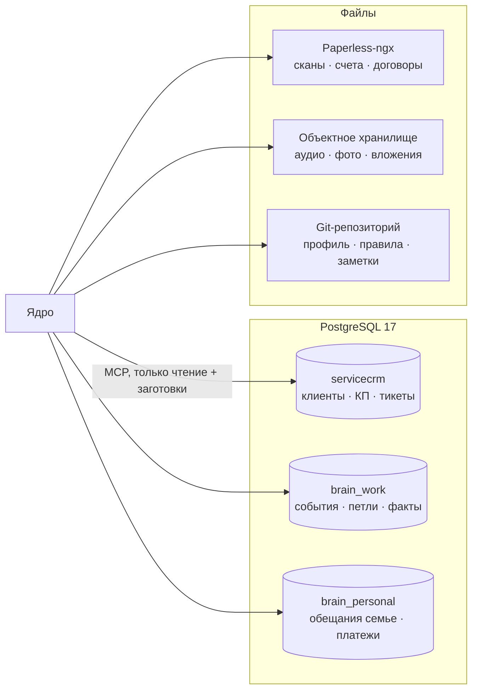
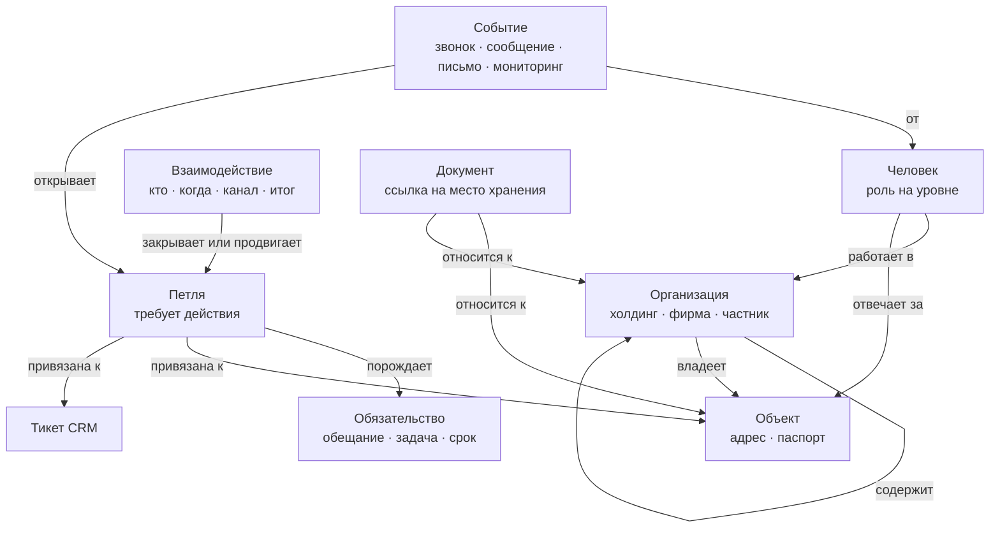
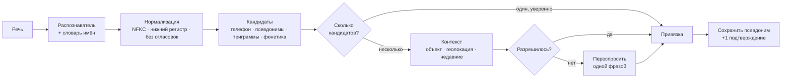
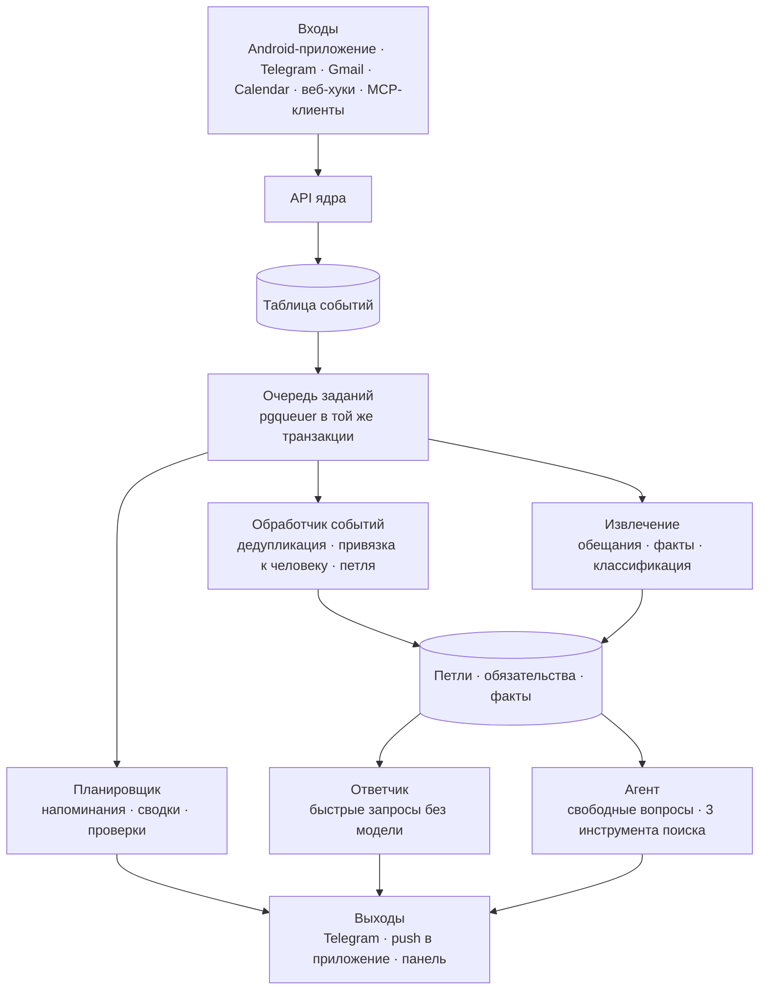
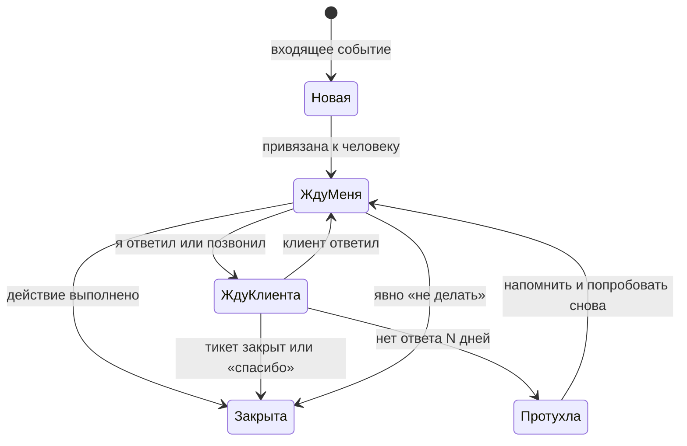
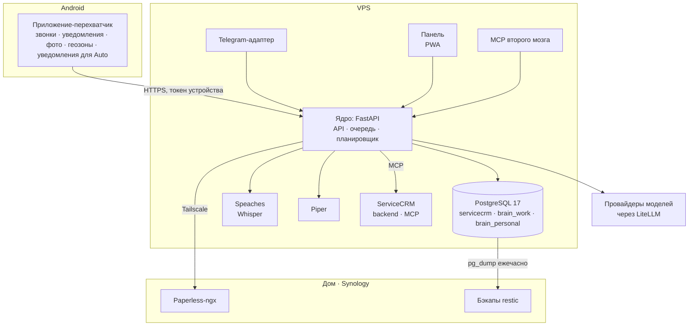

# Second Brain: архитектура

> Проектный документ по итогам интервью и исследования. Дата: 16 сентября 2026. Автор: Павел Стрельников при участии Claude Code.
> Живая копия с комментариями: https://claude.ai/code/artifact/d0a7ba42-58d7-4f3f-843b-0b6634fe907a

## 1. Резюме

Строим личный «второй мозг»: ассистент, который сам перехватывает звонки, сообщения и письма, превращает их в незакрытые петли и не даёт им умереть без реакции. Голос в машине, чат и панель — это входы к одному ядру, а не разные системы. ServiceCRM остаётся системой записи для клиентов, каталога, коммерческих предложений и тикетов и подключается как источник, а не становится центром.

Главные решения, каждое обосновано в своём разделе:

| Решение | Выбор | Отвергнуто или отложено |
| --- | --- | --- |
| Центр системы | Отдельное ядро «второй мозг» со своей памятью, CRM подключена через MCP | Расширение CRM до центра: смешивает личное с рабочим, привязывает к одной кодовой базе |
| Источник правды | PostgreSQL: рабочая схема, отдельная личная схема, CRM отдельно; файлы в Paperless-ngx и объектном хранилище | Векторная база как хранилище правды; граф как основной стор |
| Поисковые индексы | Полнотекст с триграммами, pgvector, таблица псевдонимов; всё перестраиваемо из источника правды | Отдельная векторная СУБД: лишний компонент при тысячах записей |
| Связи между сущностями | Типизированные связи в реляционной таблице, графовые запросы поверх неё | Graph DB и GraphRAG: не окупаются при единственном пользователе и малых данных |
| Перехват входящего | Своё Android-приложение: журнал звонков, уведомления обоих WhatsApp, фото по времени и месту; для бизнес-номера дополнительно официальный WhatsApp Cloud API в режиме сосуществования с приложением | Неофициальные библиотеки (Baileys, whatsapp-web.js): риск бана основного номера; ручной экспорт чатов только как запасной путь |
| Голос | Локальный Whisper со словарём имён; Telegram-бот и Android Auto как каналы в машине | Звонок на номер бота: отложен до второй фазы |
| Модели | Маршрутизация по сложности: код без модели, маленькая модель для классификации, большая для разбора речи и поиска | Одна большая модель на всё: дорого и медленно в машине |
| Хостинг | Облачный сервер как основной, Synology дома как резерв и архив | Только домашний сервер: зависит от домашнего интернета круглосуточно |
| Автоматизация | Всё автоматически, кроме отправки КП и счетов; ответы клиенту и закрытие тикетов сначала «сделать и сообщить» | Полный автомат с первого дня для действий, видимых клиенту |

Первая версия (MVP) занимает 4–6 недель ежедневных коротких итераций и закрывает главную боль: пропущенные обратные звонки и сообщения без реакции. Ориентир расходов до 100 $ в месяц. Подробности в разделе 18.

## 2. Что услышано в интервью

Дизайн стоит на этих фактах. Если какой-то из них неверен, скажи, и соответствующий раздел изменится.

| Тема | Факт | Следствие для дизайна |
| --- | --- | --- |
| Масштаб | Несколько холдингов с множеством объектов, ещё около десятка клиентов, частные клиенты; до 20 обращений в неделю | Тысячи записей, не миллионы: PostgreSQL достаточно, отдельные векторные и графовые СУБД не нужны |
| Структура клиентов | Холдинг → фирма → объект, ответственный на каждом уровне; рядовые сотрудники звонят напрямую | Иерархия организаций произвольной глубины, роль человека привязана к уровню |
| Главная боль | Услышал или прочитал, отложил, забыл через два часа | Система должна перехватывать входящее сама; диктовка вторична |
| Условие обещания | «Когда буду дома», «когда буду у компьютера» | Напоминания по контексту (место, устройство), а не только по времени |
| Настойчивость | Одного напоминания мало | Эскалация: повтор, вечерняя сводка, красное на панели |
| Защита от претензий | Нужна запись «звонил, не ответили» и «о чём говорили» | Взаимодействие как отдельная сущность с датой, каналом, содержанием |
| Каналы | Телефон, WhatsApp личный и Business, два Gmail, лично на объекте | Слушать все, разделять «работа или личное» по содержанию |
| Телефон | Android с Android Auto | Своё приложение с доступом к журналу звонков, уведомлениям, фото, геолокации |
| CRM | Живут каталог и КП; тикеты и история простаивают; ответы через MCP медленные | CRM остаётся источником, ядро отдельно; быстрые ответы без модели |
| Языки | Говорит по-русски, записи на иврите, модели на английском; распознаватель коверкает имена | Канон на иврите, псевдонимы из подтверждений, словарь для распознавателя |
| Паспорт объекта | Оборудование, серийники, сеть, пароли, провайдер, фото; система должна принуждать заполнять | Чек-лист полноты, шифрованные секреты отдельно |
| Мониторинг | Есть своя система проверки камер и дисков | Внешний источник событий в ту же очередь, что звонки |
| Документы | OneDrive, CRM, бухгалтерия, почта, WhatsApp, галерея; хочется Paperless и Synology | Единый индекс поверх мест хранения, Paperless-ngx как архив |
| Личная сфера | Все области; обещания жене с приоритетом не ниже рабочих | Отдельное хранилище личного, единый слой обязательств |
| Пользователи | Сейчас один, позже жена, возможно сотрудник | Владелец и область видимости у каждой записи с первого дня |
| Хостинг | Не решён; допустимы внешние модели; Synology есть | Облако основной, Synology резерв; провайдеры взаимозаменяемы |
| Экономия токенов | Whisper локально, простое дешёвыми моделями | Маршрутизация по сложности, бюджет и отчёт |
| Автоматизация | Всё автоматически, кроме отправки КП и счетов | Политика подтверждений по типу действия |
| Бюджет и время | До 100 $ в месяц; участие каждый будний день короткими отрезками | Маленькие ежедневные итерации, ранняя польза в машине |
| Успех | Меньше жалоб клиентов, ощущение роста КПД | Плюс измеримые показатели: обещания в срок, входящие без реакции, переносы |

Открытые пункты: есть ли API у бухгалтерской программы (ты уточнишь); формат хранения личных данных (раздел 7 даёт варианты).

## 3. Пользовательские сценарии

Каждый сценарий описан так, как он должен работать в готовой системе. Сценарии 1–4 входят в MVP, остальные в следующие фазы.

**С1. Звонок, который иначе умер бы.** Клиент звонит на телефон: «камера не пишет, вытяни записи». Ты отвечаешь «буду у компьютера вечером, сделаю». Приложение на телефоне видит входящий звонок с известного номера длительностью две минуты и отправляет событие на сервер. Сервер создаёт петлю «звонок от Эли, объект Рамат Хайфа, без действия». Через минуту после звонка в наушниках или в Telegram короткий вопрос: «Эли из Рамат Хайфы, что-то обещал?». Ты говоришь: «вытянуть записи, когда буду дома». Система создаёт обещание с условием «дома». Вечером телефон входит в геозону дома, приходит напоминание. Через 30 минут без реакции второе. В 21:00 вечерняя сводка перечисляет его первым. Утром на панели оно красное.

**С2. Сообщение без ответа.** В WhatsApp Business приходит «когда приедешь?» от контакта с объекта. Ты прочитал за рулём и не ответил. Приложение поймало уведомление, сервер знает, что это входящее от известного контакта, и что исходящего ответа не было. Через два часа: «Йоси с объекта X ждёт ответа два часа». Ты отвечаешь клиенту напрямую, приложение видит уведомление о твоём исходящем, петля закрывается сама.

**С3. Что срочно.** За рулём: «что срочно сегодня?». Ответ за две секунды без вызова большой модели, из готовой очереди: «Три пункта. Записи для Эли, просрочено со вчера. Йоси ждёт ответа. КП для холдинга обещано на сегодня, не отправлено». Ответ голосом через Telegram или Android Auto, текст дублируется в чат.

**С4. Что я обещал Ави.** «Что я обещал Ави?» Система сопоставляет «Ави» с двумя контактами, у одного открытые обещания есть, у другого нет, выбирает первого и отвечает. Если у обоих есть, переспрашивает: «Ави из холдинга или Ави с частного дома?»

**С5. Мяч у клиента.** Ты перезвонил, не ответили. Говоришь: «звонил Эли, не ответил». Взаимодействие записано с датой, петля переходит в «жду ответа», напоминание через день: «Эли не перезвонил, попробовать снова?». Через месяц при претензии ты показываешь журнал: три попытки дозвона с датами.

**С6. Описание объекта с парковки.** После визита: «Я на объекте в Хайфе. Регистратор Hikvision на 16 каналов, 12 камер, диск на 4 терабайта, роутер провайдера, интернет от Bezeq». Система разбирает в паспорт объекта, показывает, что получилось, сохраняет исходный текст. Затем: «Не хватает: фото щитка, IP регистратора, пароль от роутера». Шесть фото, снятых за последний час рядом с объектом, предложены к привязке.

**С7. Документ из почты.** В рабочий Gmail приходит счёт от поставщика. Система классифицирует дешёвой моделью: счёт, поставщик известный, сумма и срок вытащены. Предлагает: «Счёт от X на 3 200 ₪, срок 30 дней, положить в архив под объект Y?» Подтверждение одним словом. Документ в Paperless-ngx с тегами, срок оплаты в списке обязательств.

**С8. Обещание жене.** «Напомни мне забрать детей с кружка в четверг в пять». Личное хранилище, но в четверг в 16:30 напоминание стоит в той же очереди, что рабочие, и в «что срочно» оно звучит первым.

**С9. Событие от мониторинга.** Система проверки камер сообщает: диск на объекте Z перестал писать. Событие попадает в очередь как петля «требует действия», привязано к объекту, к нему подтянут паспорт с моделью диска. В утренней сводке: «Диск на Z умер, там стоит WD Purple 4 ТБ, последний раз менялся год назад».

**С10. Проактивный вопрос из чата Claude.** Ты открываешь Claude на компьютере и спрашиваешь: «Что открыто у холдинга?» Claude через MCP второго мозга получает список петель, обещаний и тикетов по всем объектам холдинга и отвечает. Никакой своей разработки интерфейса.

**С11. Фото серийника на объекте.** Ты фотографируешь этикетку регистратора и щиток. Приложение видит новые снимки в галерее, по времени и координатам относит их к объекту в Рамот и отправляет на сервер. Семейные фото вечером дома под фильтр не попадают и никуда не уходят. Маленькая модель классифицирует: этикетка, оборудование, щиток, документ, прочее. Для этикетки сначала читается штрих-код или QR без модели, затем большая модель с картинкой вытаскивает модель, серийный номер и MAC. Модель сверяется с каталогом CRM. В Telegram приходит одно сообщение: «Три фото у объекта в Рамот. На одном серийник Hikvision DS-7616, номер такой-то, есть в каталоге. Привязать к объекту и добавить в паспорт?» Ответ «да», и оборудование появляется в паспорте со ссылкой на позицию каталога, а фото в объектном хранилище. Если объект по координатам не определился, вопрос звучит «к какому объекту?». Прочитанное всегда показывается до записи: серийники с мутных фото читаются ненадёжно. Наблюдение за галереей и вопрос «привязать к объекту?» входят в MVP; чтение серийников и паспорт — фаза 2.

## 4. Требования

Функциональные требования сгруппированы по тому, что система обязана уметь. Приоритет: M = в MVP, 2 = вторая фаза, 3 = позже.

| № | Требование | Приоритет |
| --- | --- | --- |
| Ф1 | Перехватывать входящие и исходящие звонки на Android: номер, направление, длительность, время | M |
| Ф2 | Перехватывать уведомления WhatsApp и WhatsApp Business: отправитель, текст, чат, время; видеть свои исходящие по уведомлениям | M |
| Ф3 | Читать оба Gmail: письма, вложения, классификация «работа или личное» | 2 |
| Ф4 | Читать и писать Google Calendar | 2 |
| Ф5 | Создавать петлю из каждого входящего обращения; петля закрывается действием, ответом клиента или явным решением | M |
| Ф6 | Хранить взаимодействия: кто, когда, канал, содержание, исход, ссылка на петлю и тикет | M |
| Ф7 | Извлекать обещания из речи и текста: адресат, действие, срок или условие, источник; при неуверенности спрашивать | M |
| Ф8 | Напоминать по времени, по месту (геозона), по устройству (открыт десктоп), с эскалацией | M (время, место), 2 (устройство) |
| Ф9 | Отвечать на «что срочно», «кто ждёт», «что я обещал X», «что открыто у Y» за секунды без большой модели | M |
| Ф10 | Принимать голос через Telegram-бота и Android Auto; отвечать текстом и голосом | M (Telegram), 2 (Android Auto голос) |
| Ф11 | Разрешать имена людей, объектов и компаний между русским, ивритом и латиницей; накапливать псевдонимы; переспрашивать при двух кандидатах | M |
| Ф12 | Читать клиентов, объекты, контакты, тикеты, КП и каталог из ServiceCRM через MCP; создавать заготовки тикетов и задач | M |
| Ф13 | Панель: список открытых петель и обещаний, просроченное красным, календарь | M (список), 2 (календарь) |
| Ф14 | Паспорт объекта: оборудование, сеть, доступы, провайдер, фото; чек-лист полноты и напоминание после визита | 2 |
| Ф15 | Фото из галереи: привязка к объекту по времени и месту с подтверждением (M); классификация содержимого, чтение штрих-кодов, модели и серийного номера с этикетки, сверка с каталогом CRM, запись в паспорт объекта после подтверждения (2) | M (привязка), 2 (распознавание) |
| Ф16 | Индекс документов поверх Paperless-ngx, OneDrive, почты; авто-привязка к клиенту и объекту | 2 |
| Ф17 | Принимать события от внешнего мониторинга камер через веб-хук | 2 |
| Ф18 | Неоплаченные счета из бухгалтерской программы через API или выгрузку | 3 |
| Ф19 | MCP-сервер второго мозга для Claude, ChatGPT и других клиентов | 2 |
| Ф20 | Личное хранилище: обещания семье, платежи, здоровье, машина, идеи; единый слой обязательств с рабочими | M (обещания), 2 (остальное) |
| Ф21 | Второй пользователь с собственным входом и областью видимости | 3 (модель данных готова с M) |
| Ф22 | Автоответ клиенту шаблоном и закрытие тикета по «спасибо» в режиме «сделать и сообщить» | 3 |
| Ф23 | Ежедневная утренняя и вечерняя сводка; еженедельный обзор просроченного и повторно перенесённого | M (сводки), 2 (обзор) |

Нефункциональные требования:

| Свойство | Требование |
| --- | --- |
| Скорость | Ответ на готовые вопросы («что срочно») до 2 с; разбор свободной речи до 6 с от конца фразы до начала ответа |
| Доступность | Сервер круглосуточно; приложение на телефоне переживает перезагрузку и ограничения энергосбережения; при отсутствии сети события копятся на телефоне и досылаются |
| Точность сопоставления | Ложная привязка к чужому контакту недопустима без подтверждения; при неуверенности ниже порога система спрашивает |
| Стоимость | До 100 $ в месяц на сервер и модели; дневной лимит на токены с отчётом |
| Провайдеры | Смена модели или распознавателя без изменения бизнес-логики; локальные варианты для речи и классификации |
| Разделение | Личные и рабочие данные в разных хранилищах; область видимости у каждой записи; секреты объектов шифруются отдельным ключом |
| Восстановление | Ежедневный бэкап на Synology и в объектное хранилище; восстановление проверяется раз в месяц; удаление мягкое, с возможностью вернуть 30 дней |
| Провенанс | У каждого факта, извлечённого моделью, ссылка на источник (событие, транскрипт, письмо) и оценка уверенности |
| Аудит | Все действия агента и все вызовы моделей журналируются с входом, выходом и стоимостью |
| Экспорт | Все данные выгружаются в открытых форматах (SQL-дамп, JSON, файлы) одной командой |
| Языки | Интерфейс и голос на русском; записи на иврите; модели и техника на английском |

## 5. Карта источников и реализуемость интеграций

Вывод исследования: всё, что нужно для MVP, доступно официальными средствами на Android и через API Google. Единственная зона риска — распознавание ивритских имён внутри русской речи, она решается словарём и пост-коррекцией, см. раздел 9.

| Источник | Что даёт | Способ доступа | Реализуемость | Фаза |
| --- | --- | --- | --- | --- |
| Звонки (оба номера) | Номер, направление, длительность, время | Своё Android-приложение: разрешение на журнал звонков, наблюдатель за изменениями, foreground-сервис. Ограничения Google Play на это разрешение касаются только магазина; приложение ставится напрямую ([документация Android](https://developer.android.com/guide/topics/permissions/default-handlers)) | Реализуемо | M |
| WhatsApp личный | Отправитель, текст, чат, время входящих; факт исходящего | Служба чтения уведомлений в том же приложении; оба пакета (WhatsApp и Business) ловятся одной службой ([NotificationListenerService](https://developer.android.com/reference/android/service/notification/NotificationListenerService)) | Реализуемо с оговорками: не видны сообщения, прочитанные до уведомления, и чаты без звука; медиа приходит как «Фото» без содержимого; нужна дедупликация | M |
| WhatsApp Business | То же плюс полные тексты и медиа через веб-хук | Режим сосуществования Cloud API с приложением на одном номере: входящие приходят и в приложение, и на веб-хук, исходящие из приложения зеркалятся в API; групповые чаты не синхронизируются; приложение надо открывать хотя бы раз в две недели | Реализуемо; нужен аккаунт Meta Business и публичный адрес веб-хука. Ответы клиенту в течение 24 ч бесплатны | 2 |
| Gmail (оба ящика) | Письма, вложения, метки | Gmail API, опрос истории раз в 1–2 минуты; OAuth-приложение перевести в статус «в производстве», иначе токен умирает через 7 дней | Реализуемо | 2 |
| Google Calendar | События, создание, изменение | Calendar API с токеном инкрементальной синхронизации, опрос раз в 5 минут | Реализуемо | 2 |
| Голос в машине | Речь водителя, ответ вслух | Три канала: (1) Telegram-бот: голосовые сообщения приходят как OGG/Opus, ответ текстом читается Android Auto вслух, а вот голосовые ответы бота в машине не проигрываются; (2) своё приложение как «мессенджер» для Android Auto: уведомление в стиле переписки читается вслух, ответ голосом приходит текстом; (3) Gemini «отправь в WhatsApp сообщение боту» на бизнес-номер через Cloud API. Собственный голосовой ассистент в Android Auto запрещён платформой | Реализуемо через штатные механизмы, свой микрофон в машине невозможен | M (1), 2 (2, 3) |
| Фото | Снимки с временем и координатами | Полный доступ к галерее плюс разрешение на геометки; «частичный доступ» Android 14 координаты не отдаёт | Реализуемо для приложения вне магазина | 2 |
| Геозоны | «Приехал домой», «уехал из Хайфы» | Geofencing API, радиус от 150 м, задержка срабатывания 2–6 минут, до 20 минут в глубоком сне | Реализуемо для напоминаний, не для точного момента | M |
| Запись разговоров | Содержание звонка | В Израиле участник разговора вправе записывать (согласие одной стороны). Технически сторонние приложения на Android 14+ записывают только свой микрофон; штатная запись в звонилке зависит от производителя и региона | Отложено: польза не оправдывает возню; факт звонка и твоя надиктовка после него закрывают потребность | 3 |
| ServiceCRM | Клиенты, объекты, контакты, тикеты, КП, каталог | Существующий MCP-сервер и REST API | Реализуемо, уже работает | M |
| Мониторинг камер | Событие «диск не пишет», «камера офлайн» | Веб-хук в ядро с подписью | Реализуемо, нужна доработка на стороне мониторинга | 2 |
| Paperless-ngx | Архив документов с OCR | REST API загрузки и тегов; OCR иврит плюс английский настраивается; ранние ошибки с ивритом исправлены в 2023 | Реализуемо; качество OCR ивритских сканов среднее, для важных документов повторное распознавание моделью | 2 |
| OneDrive | Существующие PDF | Microsoft Graph API или разовая выгрузка в Paperless | Реализуемо | 3 |
| Бухгалтерская программа | Неоплаченные счета | API неизвестен; запасной путь: копии счетов на почту или выгрузка в Excel | Открыто | 3 |
| Речь → текст | Транскрипт | Whisper large-v3 локально: русский сильный, иврит слабее; модели ivrit.ai лучше на иврите, но рассчитаны на речь в основном на иврите. Подсказка со словарём имён работает (последние 224 токена). Облачные: OpenAI gpt-4o-transcribe 0,006 $/мин, ElevenLabs Scribe, Deepgram | Реализуемо; ивритские имена в русской речи требуют пост-коррекции по списку контактов | M |
| Текст → речь | Голос ответа | Piper локально (голос irina), Google или Azure по 16 $/млн знаков | Реализуемо | M |

Что не входит: чтение чужих сообщений в группах WhatsApp через Cloud API, SMS (почти не используется), запись разговоров.

## 6. Таксономия памяти: источник правды против индексов

Принцип, который подтверждают и Anthropic, и последние работы по памяти агентов: сырые события хранятся неизменяемо и являются правдой, всё остальное из них выводится и может быть перестроено. Векторный индекс и граф никогда не становятся источником правды.

| Слой памяти | Что это у нас | Источник правды | Как выводится | Срок хранения |
| --- | --- | --- | --- | --- |
| Сырые события | Звонки, уведомления, письма, транскрипты, веб-хуки, твои реплики ассистенту | Таблица событий, только добавление | Приходит извне | Бессрочно; аудио 90 дней, потом только текст |
| Эпизодическая | «Что произошло»: взаимодействия, разговоры с ассистентом, визиты на объекты | Таблицы взаимодействий и сессий | Из событий кодом и моделью, с ссылкой на событие | Бессрочно, свёртка в сводки после года |
| Операционная | Петли, обязательства, напоминания, состояния тикетов | Таблицы ядра и CRM | Из эпизодов через извлечение с подтверждением | До закрытия, потом архив |
| Семантическая | Факты о людях, объектах, компаниях: роли, оборудование, привычки («платят с задержкой») | Таблица фактов с интервалом действия и ссылкой на источник | Извлечение из эпизодов, ручной ввод; противоречие не удаляет старый факт, а закрывает его интервал | Бессрочно с историей версий |
| Справочная | Клиенты, объекты, контакты, каталог, цены | ServiceCRM | Синхронизация идентификаторов и имён в ядро | По правилам CRM |
| Документальная | PDF, фото, сканы | Paperless-ngx, OneDrive, CRM, объектное хранилище | Индекс в ядре: где лежит, о чём, привязки | Бессрочно, по правилам архива |
| Рабочая (контекст модели) | Профиль пользователя, правила поведения, открытые петли на сегодня, последние реплики | Короткий Markdown-профиль, редактируемый тобой, плюс выборка из таблиц | Собирается на каждый запрос | Живёт только в запросе |
| Процедурная | Как формулировать напоминания, что подтверждать, шаблоны ответов клиентам | Файлы промптов и правил в репозитории, модули промптов как в текущем ассистенте | Правится руками | Версионируется в git |
| Поисковые индексы | Триграммы, полнотекст, векторы, псевдонимы | Не источник правды | Перестраиваются из таблиц одной командой | Пересоздаются при смене модели эмбеддингов |

Провенанс и уверенность. У каждой производной записи (обязательство, факт, привязка события к человеку) хранятся: идентификатор события-источника, фрагмент текста, из которого извлечено, способ («сказал пользователь», «извлечено моделью», «выведено правилом»), уверенность и кто подтвердил. Это дешёвый провенанс: в интерфейсе рядом с фактом видна исходная фраза, и её можно поправить.

Версии и время. Факты двувременные: когда стало верным в мире и когда записано. «Йоси больше не работает на объекте» не стирает старую роль, а закрывает её интервал. Вопрос «кто отвечал за объект в марте» получает правильный ответ.

Забывание. Сырое аудио удаляется через 90 дней, текст остаётся. Закрытые петли старше года сворачиваются в помесячные сводки по клиенту, полный текст остаётся доступен поиском, но не подмешивается в контекст модели. Личные записи удаляются по явной команде, с 30-дневной корзиной.

Что отвергнуто и почему:

- **Граф знаний как основное хранилище.** Тесты 2025–2026 годов показывают, что GraphRAG выигрывает у обычного поиска только на больших корпусах и многошаговых вопросах, а на простом поиске фактов не даёт преимущества. При единственном пользователе и тысячах записей «граф» — это пять типов сущностей с внешними ключами, то есть реляционная схема. Из графовых систем берём только две идеи: двувременные факты и «закрывать, а не удалять».
- **Векторная база как хранилище.** Эмбеддинги меняются при смене модели, их нельзя редактировать построчно, и по ним нельзя отвечать «что просрочено». Только индекс.
- **Только Markdown-файлы.** Хороши для заметок и профиля, плохи для «кто ждёт ответа больше суток»: это запрос по состоянию и времени, а не по тексту. Markdown остаётся для заметок и личного слоя, см. раздел 7.

## 7. Архитектура хранения

Один сервер PostgreSQL, три изолированные базы: CRM как есть, рабочая память ядра, личная память ядра. Файлы вне базы. Индексы внутри Postgres, без отдельных поисковых и векторных серверов.

Чтение: ядро пишет в свои две базы, в CRM ходит через её MCP-сервер, файлы кладёт в архив и объектное хранилище, а профиль и правила читает из репозитория.

Почему три базы, а не одна с тремя схемами. Ты просил не смешивать личное с рабочим. Отдельная база даёт: отдельные роли доступа на уровне Postgres, отдельный бэкап и отдельное шифрование, возможность при желании увезти личную базу на Synology целиком. Цена: ядро не может сделать один SQL-запрос сразу по рабочим и личным обязательствам. Это решается единым слоем обязательств в коде ядра, который опрашивает обе базы и сливает результат. Слой один, хранилища разные.

Где что лежит:

| Данные | Хранилище | Формат | Почему |
| --- | --- | --- | --- |
| События, петли, взаимодействия, обязательства, факты, псевдонимы, индекс документов | brain_work | Реляционные таблицы + JSONB для переменных атрибутов | Запросы по состоянию и времени, транзакции, целостность ссылок |
| Личные обязательства, личные факты, личные события | brain_personal | Те же таблицы, та же схема | Один код, разные базы; разделение по данным, а не по логике |
| Заметки свободной формы, профиль пользователя, правила поведения, шаблоны | Git-репозиторий с Markdown, зеркало в таблице для поиска | Markdown с front-matter (теги, привязки) | Правится в любом редакторе, версионируется, читается моделью напрямую; таблица держит индекс и ссылки |
| Клиенты, объекты, контакты, каталог, тикеты, КП | servicecrm | Как сейчас | Уже есть, уже работает |
| Сканы, PDF, договоры, счета | Paperless-ngx на Synology или сервере | Оригинал + OCR-текст | Готовый архив с OCR, тегами, API и корзиной |
| Аудио голосовых, фото с объектов, вложения из почты | S3-совместимое хранилище (объектное в облаке) с копией на Synology | Файл + метаданные в brain_work | Дёшево, надёжно, не раздувает базу |
| Секреты объектов: пароли, ключи | brain_work, отдельная таблица | Шифрование на уровне приложения (AES-GCM, ключ вне базы) | Дамп базы без ключа бесполезен; модель не видит секрет, если не спросили явно |
| Векторы | Столбцы pgvector (halfvec, HNSW) в brain_work и brain_personal | Индекс | Меньше миллиона векторов, отдельный сервер не нужен |
| Полнотекст и нечёткий поиск | Столбцы нормализованных имён + транслитерация, GIN-индексы триграмм | Индекс | В Postgres нет словаря для иврита, триграммы работают на любой письменности |

Про Markdown для личного, к твоему вопросу. Предлагаю так: обещания, платежи и всё со сроком лежат в brain_personal, потому что по ним нужны напоминания и запросы по времени. Личные заметки, идеи, дневник и всё без срока лежат как Markdown в отдельной папке репозитория, которую можно синхронизировать с Obsidian на телефоне. Ядро индексирует эти файлы для поиска, но правдой остаётся файл. Так ты получаешь разделение, простой формат и при этом напоминания по семейным делам в общей очереди.

Эволюция схемы. Стабильное реляционное ядро: сущности, связи, события, петли, обязательства. Всё переменное в JSONB: паспорт объекта, атрибуты связей, payload события. Новый тип оборудования или новое поле в паспорте не требует миграции. Типы связей и типы событий — справочники в таблицах, а не enum в коде. Миграции через Alembic, как в CRM.

Синхронизация с CRM. Ядро хранит по каждому клиенту, объекту и контакту CRM: идентификатор, имя на иврите, телефоны, время обновления. Обновление раз в 5 минут через MCP и при каждом обращении к сущности. Записи в CRM из ядра только через её API: заготовка тикета, задача, комментарий. Ядро никогда не пишет в базу CRM напрямую.

Что отвергнуто:

- **Всё в одной базе с одной схемой.** Проще, но нарушает твоё требование разделения и усложняет раздельные права для второго пользователя.
- **Отдельная векторная СУБД (Qdrant, Weaviate).** Ещё один сервис, ещё один бэкап, а выигрыш появляется от миллионов векторов.
- **Отдельный поисковый движок (Meilisearch, Typesense).** Хорошая токенизация иврита, но проблема синхронизации с базой при десятках тысяч записей не окупается. Вернёмся, если триграммы окажутся слабы.
- **Neo4j или другая графовая СУБД.** См. раздел 6.

## 8. Модель сущностей и связей

Ядро хранит немного типов сущностей, а гибкость даёт таблица типизированных связей и JSONB-атрибуты. Клиенты, объекты, контакты, каталог и тикеты живут в CRM; ядро хранит на них ссылки и минимальную копию имени для быстрого поиска.

Чтение: событие всегда порождает петлю, петля живёт до закрытия, обязательство и взаимодействие двигают петлю по состояниям.

Основные сущности ядра и где они лежат:

| Сущность | Что хранит | Где | Почему так |
| --- | --- | --- | --- |
| Организация | Имя на иврите, тип (холдинг, фирма, частник), родитель, ссылка на клиента в CRM | Ядро + CRM | В CRM два уровня; в ядре дерево любой глубины со ссылкой на CRM-клиента у листа или корня |
| Объект | Имя, адрес, координаты, ссылка на сайт в CRM, паспорт (JSONB), чек-лист полноты | Ядро + CRM | Паспорт меняется по составу, JSONB даёт эволюцию без миграций |
| Человек | Имена на иврите, роли на уровнях, телефоны (нормализованные E.164), ссылка на контакт CRM, статус «неопознан» | Ядро + CRM | Человек без клиента допустим до привязки; телефон — главный ключ сопоставления событий |
| Псевдоним | Строка, язык, письменность, к какой сущности, откуда взят, счётчик подтверждений | Ядро | Раздел 9 |
| Событие | Тип, канал, направление, время, сырой payload (JSONB), ссылка на источник, отпечаток для дедупликации | Ядро (только добавление) | Неизменяемый журнал, из него всё восстанавливается |
| Петля | Состояние, срочность, кто ждёт, срок, привязки, причина закрытия | Ядро | Единица «незакрытого»; раздел 12 |
| Обязательство | Кто кому, действие, срок или условие (время, место, устройство), источник, уверенность, число переносов | Ядро (рабочая или личная схема) | Обещание и задача одного типа, различаются наличием адресата |
| Взаимодействие | Кто, когда, канал, содержание, итог («не ответили», «договорились»), ссылка на петлю, тикет, транскрипт | Ядро | Защита от претензий; не зависит от того, есть ли тикет |
| Документ | Где лежит (Paperless, OneDrive, CRM, почта), тип, дата, сумма, срок, привязки, текст для поиска | Ядро (индекс) | Файл остаётся на месте |
| Связь | От, к, тип, атрибуты (JSONB), дата начала и конца, источник | Ядро | Всё, что не укладывается в поля: «Йоси заменил Эли», «объект переехал» |
| Заметка | Markdown, теги, привязки, версия | Ядро | Свободное знание: «у холдинга платят с задержкой 60 дней» |

Расширения ServiceCRM, которые предлагаю сделать в самой CRM, потому что они её по природе:

- **Иерархия организаций**: поле «родительский клиент» у клиента. Мелкий клиент остаётся одноуровневым.
- **Статус «жду ответа клиента»** с датой у тикета и у задачи. Сейчас в статусах нет явного состояния «мяч у клиента».
- **Контакт без клиента** или с флагом «не привязан»: сейчас клиент обязателен.
- **Паспорт объекта**: JSONB-поле у сайта плюс таблица установленного оборудования с моделью, серийным номером, датой установки и ссылкой на позицию каталога. Секреты (пароли, ключи) не в этой таблице, см. раздел 15.
- **Вложения не только к тикету**: сейчас вложение обязано принадлежать тикету.

Ядро не дублирует данные CRM. Оно хранит идентификатор в CRM, имя для поиска и время последней синхронизации. Полные данные читаются по MCP по запросу и кэшируются на минуты.

## 9. Многоязычность и разрешение сущностей

Задача: «Эли с Рамат Хайфы», сказанное по-русски и записанное распознавателем как попало, должно указать на контакт אלי на объекте רמת חיפה. Решение — не одна модель, а конвейер из дешёвых детерминированных шагов с моделью только на спорных случаях.

Чтение: сначала точные ключи, потом нечёткие, потом контекст, и только потом вопрос пользователю; каждое подтверждение делает следующий раз точнее.

Ключи сопоставления по убыванию надёжности:

| Ключ | Когда работает | Как реализовано |
| --- | --- | --- |
| Номер телефона | Звонки, WhatsApp, письма от известного адреса | Нормализация в E.164, поиск по телефонам контактов CRM и ядра; точное совпадение = уверенность 1,0 |
| Подтверждённый псевдоним | Ты уже говорил «Эли из Рамот» и подтвердил | Таблица псевдонимов: строка, письменность, сущность, число подтверждений; точное совпадение нормализованной строки |
| Триграммы по нормализованному имени | Опечатки, другая транскрипция | pg_trgm по столбцам: имя на иврите без огласовок, транслитерация в латиницу (ICU Any-Latin), кириллическая форма если есть |
| Фонетический код | «Йоси» и «יוסי», «Хайфа» и «חיפה» | Beider-Morse: единственный алгоритм, который явно поддерживает иврит, русскую кириллицу и транслитерированный русский; совпадение кода = кандидат |
| Расстояние Джаро-Винклера ≥ 0,85 | Короткие имена, одна буква разницы | Дополнительный фильтр к триграммам |
| Контекст | Два Эли, но один на объекте, о котором шла речь минуту назад | Веса: упомянутый объект, текущая геозона, недавние взаимодействия за 7 дней, открытые петли |
| Модель | Всё ещё два кандидата с близкими баллами | Маленькая модель получает кандидатов и контекст, возвращает выбор или «спросить»; результат кэшируется как псевдоним |

Канонические имена. Правда — имя на иврите, как в CRM. У каждой сущности есть таблица форм: иврит, латиница, кириллица, и все они индексируются. Новую сущность ядро создаёт только по твоему подтверждению, иначе получим дубли «Эли» и «אלי».

Распознаватель. В подсказку Whisper (последние 224 токена) подаются имена активных контактов и объектов в кириллической записи, потому что ты говоришь по-русски. Список формируется динамически: контакты с событиями за 30 дней плюс объект из текущей геозоны. После распознавания текст проходит пост-коррекцию: найденные в транскрипте слова, похожие на имена из списка, заменяются каноническими. Это дешевле и точнее, чем искать модель, которая сама всё поймёт.

Порог переспроса. Если лучший кандидат набрал больше 0,85 и следующий отстаёт больше чем на 0,25, привязка молча. Иначе один короткий вопрос с двумя вариантами. Каждое подтверждение пишет псевдоним с источником «подтверждено пользователем». Через месяц переспросов почти не остаётся.

Неопознанные. Звонок с неизвестного номера создаёт «неопознанного человека» с номером. Система спрашивает после звонка: «Незнакомый номер, кто это?» Ты отвечаешь «Йоси с объекта в Хайфе», и человек привязывается к объекту, а при желании создаётся контакт в CRM.

Языки в ответах. Ассистент отвечает по-русски, имена произносит так, как ты их произносишь (по псевдониму с наибольшим числом подтверждений на кириллице), а в записях и в CRM держит иврит. Модели и номера оборудования на английском не переводятся.

## 10. Поиск и извлечение

Правило маршрутизации, которое подтверждают исследования: сначала детерминированные фильтры, потом гибридный текстовый и векторный поиск по отфильтрованному, и только затем модель с правом сделать ещё два-три запроса. Одна «умная» выборка не нужна.

| Тип вопроса | Пример | Метод | Модель нужна? |
| --- | --- | --- | --- |
| Состояние | «Что срочно», «кто ждёт ответа», «что просрочено» | SQL по петлям и обязательствам, готовое представление обновляется при каждом событии | Нет |
| Сущность + состояние | «Что открыто у Beit Apple», «что я обещал Ави» | Разрешение сущности (раздел 9), затем SQL по её петлям и обязательствам, включая объекты и людей ниже по иерархии | Нет, кроме спорной сущности |
| Временной | «Что было с холдингом в марте», «когда я последний раз был на объекте» | SQL по взаимодействиям и событиям с фильтром по датам; «на прошлой неделе» превращается в интервал кодом | Нет |
| Точный текст | «Счёт 4512», «серийник WD-…», модель регистратора | Триграммы и полнотекст по документам, паспортам и взаимодействиям; точные токены, которые эмбеддинги размывают | Нет |
| Смысловой | «Где мы обсуждали проблему с записью по ночам», «была ли похожая поломка» | Векторный поиск по фрагментам взаимодействий, заметок, документов; фильтр по клиенту если назван | Да, для формулировки ответа |
| Смешанный | «Отправлял ли я КП по камерам в Хайфу?» | Разрешение объекта → SQL по КП из CRM за период → полнотекст «камер» → если пусто, векторный поиск по письмам и сообщениям | Да, для сборки ответа и проверки |
| Обзорный | «Расскажи всё по этому клиенту» | Не поиск, а сборка досье: справочник из CRM, факты, открытые петли, последние 20 взаимодействий, документы; при большом объёме — сводки | Да |

Гибридный поиск внутри Postgres: два подзапроса (триграммы или полнотекст и косинусная близость по pgvector) объединяются взаимным ранжированием (RRF). Кандидатов до 50, затем переранжирование маленькой моделью до 10, если вопрос смысловой. Для точных токенов переранжирование не применяется.

Что индексируется векторно: взаимодействия (по одному фрагменту на взаимодействие), заметки (по абзацам), документы (по страницам, с заголовком документа в начале каждого фрагмента, по рецепту «контекстного поиска» Anthropic), паспорта объектов (целиком). События не индексируются, они слишком сырые; индексируется производное взаимодействие.

Модель эмбеддингов. Кандидаты: gemini-embedding-2, Cohere embed-v4, OpenAI text-embedding-3-large, локальный BGE-M3. Публичных замеров именно по ивриту мало. Решение принимается по собственному тесту на 50 вопросах из твоих данных до выбора. Векторы хранятся с именем модели, смена модели — переиндексация одной командой.

Валидация ответа. Для вопросов, где ошибка стоит дорого («отправлял ли я КП»), агент обязан привести источник: номер КП и дату или ссылку на письмо. Если источника нет, ответ «не нашёл», а не догадка. Это правило записано в процедурной памяти и проверяется тестами.

Кросс-язычный поиск. Запрос по-русски, документы на иврите. Полнотекст здесь бессилен, работает только векторная сторона, поэтому для документов вектор обязателен. Для имён работает таблица псевдонимов, см. раздел 9.

## 11. Архитектура агента и оркестрация

Ядро — детерминированный сервис на FastAPI с очередью заданий в Postgres. Модель вызывается как функция в нескольких строго очерченных местах, а не как цикл «агент решает всё сам». Это прямая рекомендация Anthropic: рабочие процессы с заранее заданными путями там, где задача понятна, и агент с инструментами только там, где нужна свобода.

Чтение: всё входящее становится событием и заданием в одной транзакции, обработчики двигают состояние, а модель участвует в извлечении и в свободных вопросах.

Что делает код, а что модель:

| Задача | Код | Модель | Почему |
| --- | --- | --- | --- |
| Приём события, дедупликация, нормализация номера | Да | Нет | Детерминировано, должно работать без сети к провайдеру |
| Привязка события к человеку | Да, по телефону и псевдонимам | Только при двух кандидатах | Раздел 9 |
| Открытие петли по входящему | Да, по правилам: входящий звонок или сообщение от известного контакта без исходящего в течение N часов | Нет | Правило простое и проверяемое |
| Закрытие петли по исходящему | Да | Нет | Факт исходящего виден в журнале |
| Классификация «работа или личное», «есть ли счёт в письме» | Нет | Маленькая модель со схемой ответа | Дёшево, при ошибке пользователь поправит |
| Извлечение обещания из речи или сообщения | Нет | Большая модель со строгой схемой: кто, кому, что, когда или при каком условии, фрагмент-источник, модальность | Свободный язык, три языка вперемешку |
| Уверенность обещания | Да, по модальности и наличию срока: «сделаю в четверг» высокая, «может, посмотрю» низкая | Модель даёт модальность, код считает | Исследования показывают, что свежесть и приоритет надёжнее считать кодом |
| Решение «спросить или сделать» | Да, по порогам и политике подтверждений | Нет | Политика должна быть предсказуемой |
| Напоминания, эскалация, сводки | Да | Формулировка текста сводки маленькой моделью | Расписание и выборка детерминированы |
| Ответы на «что срочно», «кто ждёт» | Да, шаблон по готовой выборке | Нет | Две секунды в машине |
| Свободные вопросы | Оркестрация кодом | Большая модель с инструментами: структурный поиск, текстовый поиск, чтение фрагмента | Только здесь нужна свобода |
| Действия в CRM и наружу | Да, через API с идемпотентным ключом | Модель предлагает, код исполняет после проверки политики | Модель никогда не вызывает внешний API напрямую |

Политика подтверждений. Каждое действие имеет класс: «тихо» (записать обещание, открыть петлю, привязать фото), «сделать и сообщить» (заготовка тикета, событие в календаре, автоответ клиенту, закрытие тикета по «спасибо»), «спросить» (отправка КП или счёта, создание новой сущности, удаление). Классы лежат в конфигурации и меняются без кода. Ты назвал автоответ и закрытие тикета допустимыми в автомате; я предлагаю начать с «сделать и сообщить» и переключить через месяц.

Идемпотентность. Каждый инструмент записи принимает клиентский ключ. Повторный вызов с тем же ключом не создаёт дубля. Напоминания — upsert по обязательству. Это защищает от повторов при сбое сети между телефоном и сервером.

Контекст модели на каждый вызов: профиль пользователя (Markdown до 500 слов), правила поведения, открытые петли на сегодня (список идентификаторов и заголовков), последние 10 реплик диалога, результат разрешения сущностей. Не подмешивается: история за месяцы, полные тексты документов, секреты. Полные тексты модель получает через инструмент чтения по запросу.

Много входов, одно ядро. Telegram-бот, Android-приложение, панель, MCP-сервер для Claude и ChatGPT — тонкие адаптеры над одним API. Адаптер не содержит логики: он переводит формат канала в вызов API и ответ обратно. Добавить новый канал — один файл.

MCP-сервер второго мозга. Инструменты: что срочно, петли по сущности, обещания по человеку, поиск, досье по клиенту, записать обещание, записать взаимодействие. Через него Claude Desktop или ChatGPT становятся полноценным интерфейсом. Существующий MCP CRM остаётся отдельным, ядро вызывает его само.

Отвергнуто: **полностью агентная архитектура**, где модель в цикле сама решает, что сделать по каждому событию. Дорого (каждое событие — вызов), медленно, непредсказуемо в подтверждениях, и главное — напоминания должны приходить даже когда провайдер моделей лежит.

## 12. Обнаружение обязательств и незакрытые петли

Петля — единица «незакрытого». Она открывается автоматически по входящему событию и закрывается либо действием, либо ответом другой стороны, либо твоим явным «ничего не делать». Обязательство — это то, что ты должен сделать, чтобы закрыть петлю или выполнить обещание.

Чтение: петля колеблется между «жду меня» и «жду клиента», и в каждом состоянии у неё свой таймер и своё напоминание.

Правила открытия петли (код, без модели):

| Событие | Условие | Что создаётся |
| --- | --- | --- |
| Входящий звонок от известного контакта | Длительность > 20 с и нет исходящего действия за 2 часа | Петля «жду меня» с вопросом «что-то обещал?» через 1 минуту после звонка |
| Пропущенный звонок от известного контакта | Нет обратного звонка за 1 час | Петля «перезвонить», напоминание сразу и через час |
| Входящее сообщение WhatsApp | Нет исходящего в этот чат за 2 часа в рабочее время, 12 часов ночью | Петля «ответить», отправитель ждёт |
| Письмо от известного контакта с вопросом или просьбой | Классификатор: требует ответа | Петля «ответить на письмо», 1 рабочий день |
| Событие мониторинга | Любое «отказ» | Петля «требует действия», привязана к объекту |
| Тикет в CRM без изменений | 3 рабочих дня в открытом статусе | Петля «застрявший тикет» |
| КП в CRM отправлено | 5 рабочих дней без ответа | Петля «дожать КП» |
| Обещание с истёкшим сроком | Срок прошёл | Эскалация существующей петли |

Извлечение обещания из речи или сообщения делает большая модель по строгой схеме: кто (я или другая сторона), кому, действие в повелительной форме, срок или условие (время, «когда буду дома», «после Хайфы», «когда приедет деталь»), фрагмент-источник дословно, модальность. Модальность классифицируется по форме: «сделаю, отправлю, буду» — обязательство; «постараюсь, может быть, посмотрю» — намерение; «надо бы, было бы неплохо» — идея. Обязательства записываются молча, намерения записываются с пометкой и один раз переспрашиваются в вечерней сводке, идеи попадают в заметки без напоминаний. Это правило взято из практики продуктов, извлекающих действия из встреч, и из работ Microsoft по детекции обязательств в переписке.

Разница между обещанием и разговором. Реплика «надо будет как-нибудь поменять там диск» не порождает обязательства, но порождает факт о объекте «диск на замену, без срока». Реплика «поменяю диск на следующей неделе» порождает обязательство со сроком «до конца следующей недели». Реплика «Эли просил поменять диск» порождает петлю «жду меня» от Эли без срока. Модель возвращает тип, код решает, что создать.

Условия срабатывания: время (абсолютное или «завтра утром»), место (вход в геозону «дом», выход из геозоны «Хайфа»), устройство (открыт десктоп CRM), событие (пришла деталь, то есть письмо от поставщика с трек-номером). Условие хранится структурно, планировщик проверяет его по своему источнику.

Конфликты. Два обещания на одно время или обещание на время, занятое в календаре, помечаются при создании: «в четверг в 17:00 у тебя кружок детей, точно?». Задача, перенесённая три раза, всплывает в недельном обзоре отдельным списком «ты это не делаешь, может, отменить?».

Что закрывает петлю автоматически: исходящий звонок или сообщение тому же контакту (видно из журнала и уведомлений), твоя реплика «сделал», «отправил», закрытие тикета в CRM, ответ клиента «спасибо, работает» (через классификатор, режим «сделать и сообщить»). Что никогда не закрывает автоматически: истечение срока.

## 13. Проактивный мониторинг и напоминания

Напоминание — не одноразовое сообщение, а эскалация с нарастающей заметностью. Настойчивость настраивается по типу обязательства, а не глобально, чтобы личные дела не тонули в рабочих и наоборот.

| Ступень | Когда | Куда | Пример |
| --- | --- | --- | --- |
| 0. Вопрос после события | Через 1 минуту после звонка | Telegram, голосом если в машине | «Эли из Рамат Хайфы, что-то обещал?» |
| 1. Напоминание | В момент условия: время, геозона, устройство | Push в приложение + Telegram | «Ты дома. Записи для Эли» |
| 2. Повтор | Через 30 минут без реакции | То же | Тот же текст с пометкой «второй раз» |
| 3. Вечерняя сводка | 21:00 каждый день | Telegram, голосом по запросу | Список незакрытого, просроченное первым |
| 4. Утренняя сводка | 07:30 в будни, по геозоне «выехал из дома» если раньше | Telegram, голосом в машине | «Сегодня: три петли, два обещания, один визит» |
| 5. Панель | Постоянно | Веб на телефоне и десктопе | Просроченное красным, ждущие ответа оранжевым |
| 6. Недельный обзор | Воскресенье вечером или понедельник утром, на выбор | Telegram | Протухшие петли, перенесённое три раза, объекты без визита 90 дней, КП без ответа |

Реакция на напоминание одним словом или касанием: «сделал», «позже» (перенос на час, вечер, завтра), «не буду» (закрыть с причиной), «напомни когда…» (новое условие). «Позже» без уточнения переносит на следующую ступень, а не отключает. Счётчик переносов растёт и попадает в недельный обзор.

Тишина. Ночью (23:00–07:00) и в субботу напоминания не приходят, кроме класса «срочно» (мониторинг «объект без записи», обещание с истёкшим сроком в тот же день). Класс «срочно» назначается кодом по типу петли и правится в настройках. Пока ты за рулём (Android Auto подключён), приходит не больше одного напоминания в 15 минут, остальное копится в сводку на следующей остановке.

Не быть назойливым. Напоминание не повторяется больше двух раз за ступень. Если ты три дня подряд не реагируешь на одно и то же, система вместо повтора задаёт один вопрос в вечерней сводке: «это ещё актуально?» Ответ «нет» закрывает. Такое поведение проверяется тестами на сценариях.

Проверки по расписанию (планировщик в очереди Postgres, без модели): протухшие петли раз в час, тикеты и КП в CRM раз в 4 часа, календарь и почта по своим интервалам, чек-лист паспорта объекта после визита (геозона объекта покинута) через 30 минут, объекты без визита 90 дней раз в неделю, неоплаченные счета раз в день, если источник появится.

Показатели, которые копятся автоматически и показываются в недельном обзоре: доля обещаний, закрытых в срок; среднее время реакции на входящее; число входящих без реакции больше суток; число переносов на задачу; число петель в состоянии «жду клиента» старше недели. Это те цифры, по которым через месяц станет видно, работает система или нет.

## 14. Голосовой UX в машине

Ограничение платформы: Android Auto не пускает сторонние голосовые ассистенты и не даёт приложению свой микрофон на экране машины. Всё, что можно, — это голос через Google и чтение уведомлений вслух. Дизайн строится вокруг этого, а не против.

Три канала, в порядке появления:

| Канал | Как говоришь | Как отвечает | Плюсы | Минусы | Фаза |
| --- | --- | --- | --- | --- | --- |
| Telegram-бот | Голосовое сообщение боту (кнопка микрофона в Telegram на экране машины или на телефоне) | Текст, который Android Auto читает вслух; голосовой файл в чате для прослушивания на остановке | Ноль разработки клиента, работает с первого дня, история видна в чате | Голосовые ответы бота в машине не проигрываются, только текст; Telegram в Android Auto периодически глючит | M |
| Своё приложение как «мессенджер» | Ассистент присылает уведомление в стиле переписки, Android Auto читает его вслух и предлагает ответить голосом; «Окей Google, ответь» — речь превращается в текст и приходит в приложение | Следующее уведомление, снова вслух | Штатный механизм Android Auto, голос в обе стороны, работает без Telegram; своё приложение и так нужно для перехвата | Инициировать разговор можно только ответом на уведомление; для «спроси сам» приложение раз в N минут в поездке может присылать «слушаю» при нажатии кнопки на руле | 2 |
| Gemini → WhatsApp на бизнес-номер | «Окей Google, отправь в WhatsApp сообщение ассистенту: что срочно» | Ответ приходит в WhatsApp, читается вслух | Полностью без рук, инициируется тобой | Требует Cloud API на бизнес-номере, ответ идёт через Meta | 2 |

Отложено: звонок на номер бота (телефония, распознавание в реальном времени, отдельный провайдер). Даёт настоящий диалог, но стоит больше и дублирует каналы выше. Вернёмся, если они окажутся неудобными.

Как звучит разговор. Ответы короткие: не больше трёх пунктов, не больше 25 слов на пункт, имена в твоём произношении, числа словами. Если пунктов больше трёх, ассистент говорит «и ещё четыре, сказать?». Подтверждения — одним словом: «да», «нет», «позже». Ассистент никогда не задаёт два вопроса подряд.

Сценарии из промпта и как они идут:

| Фраза | Что происходит |
| --- | --- |
| «Что срочно сегодня?» | Быстрый ответ без модели: просроченное, ждущие ответа, обещания на сегодня, визиты. Три пункта, остальное по запросу |
| «Что я обещал Ави?» | Разрешение «Ави» (раздел 9), выборка открытых обязательств, ответ списком. При двух Ави — один вопрос |
| «Напомни позвонить ему после Хайфы» | «Ему» берётся из последней сущности в диалоге; «после Хайфы» — выход из геозоны объекта или города; создаётся обязательство с условием, подтверждение «напомню, когда выедешь из Хайфы» |
| «Только что говорил с Давидом, диск сдох, меняем на следующей неделе» | Взаимодействие с Давидом (привязка по последнему звонку с его номера), факт о объекте «диск неисправен», обязательство «заменить диск» со сроком до конца следующей недели, заготовка тикета в CRM в режиме «сделать и сообщить»; ответ «записал, тикет создан, напомню в понедельник» |
| «Что открыто у Beit Apple?» | Разрешение объекта или организации, выборка петель и обязательств по ней и по всему, что ниже в иерархии, плюс открытые тикеты из CRM |
| «Отправлял ли я то КП?» | «То» — последнее КП, упомянутое в диалоге или по последнему клиенту; проверка в CRM по статусу и в почте по факту отправки; ответ с датой или «не нашёл отправки» |

Исходный транскрипт всегда сохраняется рядом с тем, что из него извлечено. Если за рулём что-то распозналось криво, вечером это видно и правится одним касанием, а исправление становится псевдонимом.

Задержки. Telegram-путь: загрузка голосового 1 с, распознавание локальным Whisper на процессоре 2–4 с для 10-секундной фразы, разбор моделью 2–3 с, ответ. Итого 5–8 с на свободную фразу и 2 с на быстрые вопросы. Если локальное распознавание окажется медленнее, переключение на облачное — одна настройка.

## 15. Безопасность, приватность, бэкапы, аудит

Модель угроз для одного пользователя: потеря данных из-за сбоя или ошибки, утечка дампа базы или файлов с сервера, потеря телефона, компрометация ключей провайдеров, случайное удаление, и на будущее — второй пользователь, которому не всё положено видеть.

| Область | Решение | Почему так |
| --- | --- | --- |
| Вход | Один аккаунт с паролем и TOTP; Telegram-бот принимает только твой user id; Android-приложение авторизуется долгоживущим токеном устройства, отзываемым с панели | Пароль плюс второй фактор закрывают панель; бот и телефон привязаны к конкретным идентификаторам |
| Сеть | Сервер за Cloudflare Tunnel или Tailscale, как сейчас у CRM; веб-хуки (WhatsApp, мониторинг) на отдельном пути с проверкой подписи | Ни один порт не открыт напрямую; подпись отсекает чужие запросы |
| Права | Роли: владелец, член семьи, сотрудник. У каждой записи владелец и область: рабочая, личная, общая семейная. Проверка в одном месте API. Личная база физически отдельна | Второй пользователь добавляется без переделки; личное не утечёт через общий запрос |
| Секреты объектов | Отдельная таблица, шифрование AES-GCM на уровне приложения, ключ в файле вне базы (age или sops), расшифровка только по явной команде «дай пароль от роутера в Рамот» с записью в аудит | Дамп базы без ключа бесполезен; модель не получает секреты в контекст случайно |
| Диск | LUKS на сервере, Synology со своим шифрованием общей папки | Кража диска у хостера не раскрывает данные |
| Внешние модели | Тексты уходят провайдерам; секреты никогда, личная база по умолчанию тоже нет (переключатель); ключи провайдеров в переменных окружения, ротация раз в квартал | Ты допускаешь внешние модели, но граница нужна |
| Телефон | Приложение хранит только буфер несинхронизированных событий, шифрованный ключом устройства; при потере телефона токен устройства отзывается с панели | На телефоне нет копии базы |
| Бэкапы | Ежечасно pg_dump всех трёх баз, restic на Synology по SFTP и в S3-совместимое хранилище; файлы объектного хранилища зеркалятся на Synology раз в день; Paperless экспортирует сам себя раз в день; Markdown в git | Потеря не больше часа; две независимые копии в разных местах |
| Восстановление | Скрипт «поднять всё с нуля из бэкапа» и ежемесячная проверка на пустом сервере с таймером; цель — восстановление за 2 часа | Бэкап без проверенного восстановления не бэкап |
| Удаление | Мягкое удаление везде, корзина 30 дней, физическое удаление по расписанию; события никогда не удаляются, только помечаются | Случайное «удали» обратимо |
| Аудит | Таблица действий: кто (пользователь или агент), что, когда, с каким входом, результат; все вызовы моделей с промптом, ответом, токенами и ценой; хранение год | Разбор «почему система решила так» и отчёт по расходам |
| Версии | Факты двувременные, паспорта объектов с историей изменений, заметки в git | Любую правку можно откатить и увидеть, кто её сделал |
| Экспорт | Команда, собирающая SQL-дампы, JSON всех сущностей, файлы и Markdown в один архив | Никакой привязки к поставщику: всё открытое |
| Провайдеры | Смена модели, распознавателя, эмбеддингов, хранилища файлов — настройка, а не код | Раздел 16 |

Что отвергнуто: pgcrypto внутри базы (разработчики Postgres сами не рекомендуют для новых систем, и ключ пришлось бы держать в базе), pgBackRest с восстановлением на момент времени (правильно, но операционно тяжело; при часовом дампе и малой базе не окупается, вернёмся, если минуты потерь станут важны).

## 16. Стратегия моделей и провайдеров

Правило: код без модели везде, где можно; маленькая модель для классификации; большая только для разбора свободной речи, извлечения обязательств и свободных вопросов. Каждый слой заменяем настройкой.

| Задача | Уровень | Кандидаты | Ориентир цены |
| --- | --- | --- | --- |
| Речь → текст | Локально на сервере | Speaches (faster-whisper, CPU, int8) с whisper-large-v3 для русского; модель ivrit.ai large-v3-turbo для фраз в основном на иврите; облачный резерв OpenAI gpt-4o-transcribe | 0 $ локально; 0,006 $/мин облако; при 20 мин в день ≈ 3,6 $/мес в облаке |
| Текст → речь | Локально | Piper, голос ru_RU irina; облачный резерв Google или Azure | 0 $ локально; 16 $/млн знаков облако |
| Классификация: работа или личное, тип письма, требует ли ответа, модальность | Маленькая облачная модель | Claude Haiku 4.5, GPT-5 nano, Gemini 2.5 Flash-Lite; локальные 3–4B на процессоре слабы на иврите, годятся только для русского и английского | 1–17 $/мес при 160 вызовах в день |
| Извлечение обещаний и фактов, разбор свободной речи, ответы на свободные вопросы, сводки | Большая модель | Claude Sonnet 5 как основной; Opus 5 не нужен; OpenAI и Gemini как замена | ≈ 24 $/мес при 40 вызовах в день по 6 тыс. токенов входа |
| Переранжирование поиска | Маленькая модель или локальный cross-encoder | bge-reranker-v2-m3 локально | 0 $ |
| Эмбеддинги | Облако или локально | gemini-embedding-2, Cohere embed-v4; BGE-M3 локально при желании нулевой зависимости | < 1 $/мес |
| Чтение серийников с фото, OCR сложных сканов | Большая модель с изображениями, редко | Claude Sonnet 5 | Единицы долларов в месяц |

Абстракция. Pydantic AI как каркас вызовов с типизированным ответом, LiteLLM как маршрутизатор к любому провайдеру с учётом стоимости, Instructor для чистого извлечения по схеме с повтором при невалидном ответе. Существующий registry провайдеров из ассистента CRM заменяется этой связкой: он делал то же самое, но без схем и учёта цены.

Маршрутизация по сложности в коде: сначала маленькая модель со схемой; если валидация не прошла или уверенность ниже порога, повтор большой моделью. Так большинство писем и сообщений обрабатываются дёшево, а сложные случаи получают сильную модель.

Бюджет. Дневной лимит расходов в настройках, по умолчанию 3 $. При достижении 80 % — уведомление, при 100 % — модели отключаются, кроме извлечения обещаний из твоих реплик, а сводки собираются кодом без текста модели. Отчёт по расходам в недельном обзоре: по задачам и по провайдерам.

Кэш. Один и тот же документ или сообщение не разбирается дважды: отпечаток входа и версия промпта — ключ кэша. Промпты с общим префиксом (профиль, правила) используют кэширование префикса у провайдера.

Что остаётся детерминированным навсегда: открытие и закрытие петель, расписание напоминаний, привязка по телефону, подсчёт уверенности, политика подтверждений, все записи в CRM и наружу. Если провайдер недоступен, напоминания и быстрые ответы продолжают работать, а разбор свободной речи ставится в очередь и выполняется, когда связь вернётся, с уведомлением «разберу позже».

Отвергнуто: локальная большая модель на GPU (дорого, слабо на иврите, не нужно при допустимости облака); один провайдер на всё (ты просил независимости, и лучшие модели по задачам разные).

## 17. Хостинг, компоненты и стек

Рекомендация: облачный VPS в Европе как основной, Synology дома как резерв, архив документов и вторая копия бэкапов. Разработка идёт на домашнем компьютере в Докере, как сейчас.

| Вариант | Плюсы | Минусы | Вердикт |
| --- | --- | --- | --- |
| Облачный VPS (Hetzner CX43, Netcup RS 2000, OVH VPS-3: 8 vCPU, 16 ГБ, 16–17 €/мес) | Круглосуточно, не зависит от домашнего интернета и электричества, публичный адрес для веб-хуков, хватит для Whisper на процессоре | Данные у хостера (шифруем диск и секреты) | Основной |
| Домашний сервер или Synology | Данные дома, бесплатно | Домашний интернет и электричество, публичный адрес через туннель, Whisper на Synology медленный | Резерв, архив, бэкап |
| Гибрид: ядро в облаке, файлы дома | Файлы не покидают дом | Ядру нужен доступ к файлам через туннель, задержки | Частично: Paperless можно держать дома, ядро ходит к нему по Tailscale |

Компоненты и границы:

Чтение: все входы приходят в одно ядро по HTTPS, ядро владеет базами и очередью, а CRM, архив и провайдеры — соседи, к которым ядро ходит по своим протоколам.

API ядра, границы модулей:

| Модуль | Отвечает за | Наружу |
| --- | --- | --- |
| ingest | Приём событий от всех источников, дедупликация, запись события и задания в одной транзакции | POST /events с ключом идемпотентности |
| identity | Организации, объекты, люди, псевдонимы, разрешение сущностей, синхронизация с CRM | GET /resolve, GET /entities |
| loops | Петли, состояния, правила открытия и закрытия | GET /loops, POST /loops/{id}/close |
| commitments | Обязательства, условия, эскалация, единый слой над двумя базами | GET /commitments, POST /commitments |
| extract | Вызовы моделей по схемам: обещания, факты, классификация; кэш; бюджет | Внутренний |
| retrieve | Гибридный поиск, досье, быстрые ответы | GET /brief, GET /search, GET /dossier/{id} |
| notify | Ступени напоминаний, тишина, доставка в каналы | Внутренний |
| documents | Индекс документов, связь с Paperless и объектным хранилищем | POST /documents, GET /documents |
| adapters | Telegram, Android, панель, MCP-сервер, Gmail, Calendar, WhatsApp Cloud API, веб-хук мониторинга | Каждый адаптер — отдельный процесс или роутер |

Стек с альтернативами:

| Слой | Выбор | Альтернатива | Почему выбор |
| --- | --- | --- | --- |
| Язык и каркас | Python 3.12, FastAPI, SQLAlchemy, Alembic | Go, Node | Совпадает с CRM и ассистентом, один язык во всём проекте |
| База | PostgreSQL 17 с pgvector 0.8, pg_trgm, unaccent | Postgres 18 | Проверенная связка, расширения зрелые |
| Очередь и планировщик | pgqueuer (заявки в той же транзакции, retry, cron, LISTEN/NOTIFY) | Celery + Redis, procrastinate | Один компонент меньше; Redis не нужен при десятках заданий в минуту |
| Модели | Pydantic AI + LiteLLM + Instructor | LangChain | Тоньше, типизированные ответы, маршрутизация по цене |
| Речь | Speaches (faster-whisper) и Piper в Докере | whisper.cpp server | OpenAI-совместимый API, простая замена на облако |
| Android | Kotlin, foreground-сервис, NotificationListenerService, CallLog observer, Geofencing, MessagingStyle-уведомления для Android Auto, WorkManager для досылки | Flutter | Нужны системные API Android, нативно проще |
| Telegram | aiogram 3, long polling | python-telegram-bot | Зрелый, без публичного адреса |
| Панель | React + TypeScript + Vite + shadcn/ui, PWA, как в CRM | Svelte | Переиспользуем компоненты и опыт CRM |
| Документы | Paperless-ngx с OCR heb+eng | Docspell | Готовый API, теги, корзина |
| Файлы | S3-совместимое хранилище у хостера (≈ 6 €/мес) с зеркалом на Synology | MinIO на VPS | Меньше администрирования |
| Бэкапы | pg_dump + restic на Synology и S3 | pgBackRest | Простота при малой базе |
| Секреты | age или sops для ключей, AES-GCM в приложении | Vault | Один пользователь, Vault избыточен |
| Сеть | Cloudflare Tunnel для панели и веб-хуков, Tailscale между VPS и домом | Только Tailscale | У тебя уже есть туннель; Tailscale для дома |
| Наблюдаемость | Структурные логи в JSON, метрики в Postgres, страница «здоровье» на панели: последнее событие с телефона, длина очереди, расход токенов | Prometheus + Grafana | Достаточно для одного человека, добавим Grafana при желании |

Место в репозитории: ядро как новый каталог `brain/` рядом с `backend/`, `assistant/` и `mcp-server/`, со своим Dockerfile и сервисом в docker-compose. Существующий `assistant/` со временем становится тонким адаптером к ядру или удаляется.

## 18. MVP, дорожная карта, миграция

MVP закрывает главную боль: звонок или сообщение, на которые ты не отреагировал, не умирают. Всё остальное строится поверх, когда MVP уже работает в машине каждый день. Оценки в неделях исходят из ежедневных коротких итераций по будням, при этом основной код пишу я, а ты проверяешь на живых данных.

**MVP, 4–6 недель.** Критерий готовности: неделя без единого забытого обратного звонка по данным системы.

| Неделя | Что появляется | Что ты проверяешь |
| --- | --- | --- |
| 1 | Ядро: базы brain_work и brain_personal, таблицы событий, людей, петель, обязательств, псевдонимов; очередь; синхронизация клиентов и контактов из CRM по MCP; Telegram-бот с текстом | Пишешь боту «что срочно», получаешь пустой, но живой ответ; видишь своих клиентов в ядре |
| 2 | Android-приложение: журнал звонков, уведомления обоих WhatsApp, отправка событий, буфер офлайн; правила петель для звонков и сообщений; напоминания по времени | После звонка приходит вопрос «что-то обещал?»; сообщение без ответа через два часа всплывает |
| 3 | Голос: Whisper локально со словарём имён, разбор обещаний большой моделью, разрешение сущностей по телефону и псевдонимам с переспросом; вечерняя и утренняя сводка | Говоришь боту голосом за рулём, обещание появляется с правильным человеком; вечером сводка |
| 4 | Геозоны «дом» и объекты; напоминания по месту с эскалацией; заготовка тикета в CRM из обещания; панель со списком петель и красным просроченным | «Когда буду дома» срабатывает; тикет появляется в CRM; панель на телефоне |
| 5–6 | Взаимодействия «звонил, не ответили», состояние «жду клиента»; личные обещания в brain_personal через единый слой; экспорт, бэкапы на Synology, проверка восстановления; тесты на сценариях С1–С4 | Неделя боевого использования, правки по замечаниям |

**Фаза 2, 6–8 недель после MVP.** Gmail и Calendar с классификацией; WhatsApp Cloud API в режиме сосуществования на бизнес-номере; своё приложение как мессенджер для Android Auto с голосом в обе стороны; паспорт объекта с чек-листом и привязкой фото; Paperless-ngx и индекс документов; веб-хук мониторинга; MCP-сервер второго мозга для Claude и ChatGPT; недельный обзор и показатели; расширения CRM (иерархия, «жду клиента», контакт без клиента, паспорт объекта).

**Фаза 3, по мере надобности.** Второй пользователь с ролями; автоответы клиенту и закрытие по «спасибо» в автомате; бухгалтерия, если найдётся API; OneDrive; звонок на номер бота, если каналы фазы 2 окажутся неудобными; Gemini-канал через WhatsApp.

Порядок внутри фаз можно менять по твоим ощущениям после каждой недели. Единственное жёсткое правило: перехват звонков и сообщений раньше всего остального, потому что это главная боль.

**Миграция.** Переносить нечего, подключаем. Клиенты, объекты, контакты, каталог, тикеты и КП остаются в CRM и синхронизируются в ядро ссылками и именами. Существующий ассистент CRM продолжает работать, пока ядро не покроет его функции, потом становится адаптером. Старая переписка WhatsApp: разовый импорт экспортов чатов после того, как псевдонимы накопятся на живом потоке, чтобы старые сообщения легли точнее; это фаза 2. Старая почта: подгрузка истории за год через Gmail API одной командой в фазе 2. Документы с OneDrive: разовый перенос в Paperless в фазе 3, с автоматической привязкой по названию клиента в имени файла и ручной проверкой остального. Ничего не удаляется на старых местах, пока новое не проверено.

## 19. Тестирование, отказы, открытые вопросы, стоимость

Тестируем поведение на сценариях, а не только функции. Правило из практики Anthropic по оценке агентов: там, где результат проверяем кодом, проверяем кодом; модель-судья только для свободных ответов; несколько прогонов на каждый сценарий, потому что модель недетерминирована.

| Уровень | Что проверяется | Как |
| --- | --- | --- |
| Единичные тесты | Нормализация номеров, правила петель, эскалация, расчёт уверенности, политика подтверждений, идемпотентность | pytest, без сети и без моделей |
| Разрешение сущностей | 100 пар «как сказал → кто это» из твоих реальных контактов, включая кириллические искажения | Точность ≥ 95 % на однозначных, 0 ложных привязок к чужому контакту; при провале система обязана спросить |
| Извлечение обещаний | 60 реплик на русском с ивритскими именами и английскими моделями: обязательство, намерение, идея, не-обещание | Схема совпадает по владельцу, действию, сроку и типу в ≥ 90 %; каждый сценарий 5 прогонов, засчитывается только стабильный успех |
| Распознавание речи | 30 записей твоего голоса в машине с именами | Доля правильно распознанных имён после пост-коррекции ≥ 90 %; сравнение локального Whisper и облака на одном наборе |
| Поиск | 50 вопросов с известным правильным ответом | Правильный документ или запись в топ-3 в ≥ 90 % |
| Сценарии С1–С4 | Полный путь от события до напоминания | Интеграционный тест с поддельным телефоном и заморозкой времени |
| Назойливость | 30 дней синтетических событий | Не больше 2 повторов на ступень, тишина ночью, вопрос «актуально ли» после 3 дней |
| Восстановление | Поднять систему из бэкапа на чистой машине | Раз в месяц, по таймеру, цель 2 часа |
| Живая проверка | Ты в машине каждый будний день | Дневник расхождений: что система сказала не так, что пропустила; разбор раз в неделю |

Отказы и защита:

| Что ломается | Последствие | Защита |
| --- | --- | --- |
| Приложение на телефоне убито системой энергосбережения | Звонки и сообщения не доходят | Foreground-сервис, исключение из оптимизации батареи, повторная привязка слушателя, проверка «последнее событие с телефона старше 2 часов» с уведомлением |
| Нет сети между телефоном и сервером | События теряются | Буфер на телефоне, досылка с ключами идемпотентности |
| WhatsApp изменил формат уведомлений | Сообщения не разбираются | Сырые уведомления сохраняются целиком, парсер обновляется, история переразбирается |
| Провайдер моделей недоступен или бюджет исчерпан | Разбор речи не работает | Напоминания и быстрые ответы без модели продолжают работать, разбор ставится в очередь, уведомление «разберу позже» |
| Распознаватель исказил имя | Обещание привязано не к тому | Порог уверенности, переспрос, исходный транскрипт рядом, правка одним касанием |
| Модель выдумала обещание из болтовни | Лишнее напоминание | Модальность и подтверждение для намерений, дословный фрагмент-источник, «не буду» закрывает и обучает |
| Дубль события (телефон переслал дважды) | Две петли | Отпечаток события и ключ идемпотентности |
| CRM недоступна | Нет справочника | Кэш имён и телефонов в ядре, заготовки тикетов копятся в очереди |
| Случайное удаление | Потеря данных | Мягкое удаление, корзина 30 дней, события неудаляемы |
| Сервер потерян | Всё лежит | Бэкап не старше часа на Synology и в S3, скрипт восстановления, проверенный ежемесячно |
| Ты перестал реагировать на систему | Она бесполезна | Показатели в недельном обзоре, дневник расхождений, честный разговор через месяц |

Открытые вопросы, которые надо решить до или во время MVP:

- **Хостинг**: какой VPS и когда переезжать с домашнего компьютера. Предложение: разработка дома, переезд в облако на 3-й неделе, когда появится голос и приложение.
- **Модель эмбеддингов**: выбираем по тесту на 50 вопросах из твоих данных, фаза 2.
- **Бухгалтерская программа**: есть ли API, ты уточнишь.
- **Личные заметки**: Markdown в git с синхронизацией в Obsidian или всё в brain_personal. Предложение в разделе 7, решение за тобой.
- **Дни тишины**: суббота целиком или только вечер пятницы и суббота до вечера.
- **Автоответ клиенту и закрытие тикета по «спасибо»**: полный автомат сразу или через месяц «сделать и сообщить».
- **WhatsApp Cloud API**: заводить ли Meta Business аккаунт в фазе 2 или ограничиться уведомлениями.

Стоимость и сложность:

| Статья | Ориентир в месяц |
| --- | --- |
| VPS 8 vCPU, 16 ГБ | 16–17 € |
| Объектное хранилище | ≈ 6 € |
| Модели: маленькие и большие при 200 вызовах в день | 25–45 $ при Claude Haiku 4.5 и Sonnet 5; 5–25 $ при более дешёвых поставщиках |
| Распознавание и синтез речи | 0 $ локально, до 4 $ при облачном резерве |
| Telegram, Gmail, Calendar, Cloud API в пределах 24 ч | 0 $ |
| Итого | 50–75 $ при основном сценарии, в пределах твоих 100 $ |

Главные драйверы сложности, по убыванию: Android-приложение с надёжным фоновым перехватом; разрешение сущностей на трёх письменностях; извлечение обещаний из смешанной речи; интеграция Android Auto через уведомления; всё остальное — обычная веб-разработка на знакомом стеке.

## 20. Исследование: источники и что из них взято

Исследование велось 16 сентября 2026 по трём направлениям: память и надёжность агентов, реализуемость на Android и WhatsApp, стек хранения и интеграций. Часть первоисточников была недоступна из среды исследования, по ним использованы выдержки и вторичные источники; такие места помечены в тексте словами «ориентир» и «по данным».

Память, поиск и надёжность агентов:

| Источник | Что взято |
| --- | --- |
| [Building effective agents, Anthropic, 2024](https://www.anthropic.com/engineering/building-effective-agents) | Рабочие процессы вместо свободного агента там, где задача понятна; контрольные точки перед необратимым |
| [Effective context engineering, Anthropic, 2025](https://www.anthropic.com/engineering/effective-context-engineering-for-ai-agents) и [документация memory tool](https://platform.claude.com/docs/en/agents-and-tools/tool-use/memory-tool) | Память как каталог файлов, чтение по требованию, короткий профиль в контексте |
| [Contextual Retrieval, Anthropic, 2024](https://www.anthropic.com/engineering/contextual-retrieval) | Заголовок документа в каждом фрагменте, BM25 плюс векторы, переранжирование |
| [Writing effective tools for agents, Anthropic, 2025](https://www.anthropic.com/engineering/writing-tools-for-agents) и [Demystifying evals, 2026](https://www.anthropic.com/engineering/demystifying-evals-for-ai-agents) | Мало консолидированных инструментов; код-проверки где возможно; несколько прогонов на сценарий |
| [Practical guide to building agents, OpenAI, 2025](https://cdn.openai.com/business-guides-and-resources/a-practical-guide-to-building-agents.pdf) | Слои ограждений, эскалация к человеку при необратимом |
| [GraphRAG, Microsoft, 2024](https://arxiv.org/abs/2404.16130), [GraphRAG-Bench, ICLR 2026](https://arxiv.org/abs/2506.05690), [Do We Still Need GraphRAG?, 2026](https://arxiv.org/abs/2604.09666) | Граф окупается только на больших корпусах и многошаговых вопросах; отказ от графовой СУБД |
| [MemGPT, 2023](https://arxiv.org/abs/2310.08560) и [Letta: benchmarking memory, 2025](https://www.letta.com/blog/benchmarking-ai-agent-memory/) | Простая файловая память с поиском не хуже специализированных библиотек; важнее умение агента искать |
| [Mem0, 2025](https://arxiv.org/abs/2504.19413), [Zep/Graphiti, 2025](https://arxiv.org/abs/2501.13956) | Двувременные факты, закрывать вместо удалять, эпизоды под фактами; графовая надбавка мала |
| [LongMemEval, ICLR 2025](https://arxiv.org/abs/2410.10813) | Индексировать мелкие единицы, извлечённые факты рядом с текстом, время в фильтр |
| [MemMachine, 2026](https://arxiv.org/abs/2604.04853), [ESAA event-sourced memory, 2026](https://arxiv.org/abs/2606.23752) | Неизменяемый журнал как правда, индексы как перестраиваемые проекции |
| [Don't Ask the LLM to Track Freshness, 2026](https://arxiv.org/abs/2606.01435) | Свежесть и приоритет считать кодом |
| [Commitment detection, Microsoft, WSDM 2019](https://www.microsoft.com/en-us/research/wp-content/uploads/2019/01/AzarbonyadWSDM2019.pdf), [Smart To-Do, ACL 2020](https://aclanthology.org/2020.acl-main.767/), [Granola on action items, 2025](https://www.granola.ai/blog/meeting-action-items-ai-extraction) | Классификация по модальности, переписывание в повелительную форму, уверенность по форме высказывания |
| [MMTEB, 2025](https://arxiv.org/abs/2502.13595), [BGE-M3](https://arxiv.org/html/2402.03216v3) | Кандидаты в модели эмбеддингов; данных по ивриту мало, нужен свой тест |

Android, WhatsApp, голос:

| Источник | Что взято |
| --- | --- |
| [CallLog.Calls](https://developer.android.com/reference/android/provider/CallLog.Calls), [default handlers policy](https://developer.android.com/guide/topics/permissions/default-handlers) | Журнал звонков доступен приложению вне магазина; ограничение только для Google Play |
| [NotificationListenerService](https://developer.android.com/reference/android/service/notification/NotificationListenerService), [Doze and standby](https://developer.android.com/training/monitoring-device-state/doze-standby) | Чтение уведомлений обоих WhatsApp; ограничения по прочитанным и медиа; защита от убийства процесса |
| Описания режима сосуществования WhatsApp ([WATI](https://support.wati.io/en/articles/11822402-introducing-whatsapp-coexistence), [Voltade](https://voltade.com/sg/learn/whatsapp/whatsapp-coexistence-limitations)) | Один номер в приложении и в Cloud API; группы не синхронизируются; риск бана неофициальных библиотек |
| [Android Auto: messaging notifications](https://developer.android.com/training/cars/communication/notification-messaging), [apps for cars](https://developer.android.com/training/cars/apps) | Голос только через Google: чтение вслух и ответ через уведомления в стиле переписки; свой ассистент невозможен |
| [Gemini extensions](https://support.google.com/gemini/answer/15574928) | Отправка сообщения в WhatsApp голосом как канал ввода |
| [Media access](https://developer.android.com/training/data-storage/shared/media), [partial photo access](https://developer.android.com/about/versions/14/changes/partial-photo-video-access) | Полный доступ нужен для координат фото |
| [Geofencing](https://developer.android.com/develop/sensors-and-location/location/geofencing) | Радиус от 150 м, задержка минуты, перерегистрация после перезагрузки |
| [Whisper prompting guide](https://github.com/openai/openai-cookbook/blob/main/examples/Whisper_prompting_guide.ipynb), [ivrit.ai models](https://huggingface.co/ivrit-ai/whisper-large-v3-turbo-ct2), [Speaches](https://github.com/speaches-ai/speaches) | Словарь имён в подсказке, локальный сервер распознавания, ивритские модели для ивритской речи |
| [Piper voices](https://github.com/rhasspy/piper/blob/master/VOICES.md) | Русский синтез локально |
| Законы о записи разговоров в Израиле ([обзор](https://www.recordinglaw.com/world-laws/world-recording-laws/israel-recording-laws/)) | Запись участником разрешена; технически ограничено; отложено |

Хранение и интеграции:

| Источник | Что взято |
| --- | --- |
| [pgvector](https://github.com/pgvector/pgvector) | HNSW, halfvec, итеративный скан для фильтров; достаточно до миллиона векторов |
| [pg_trgm](https://www.postgresql.org/docs/current/pgtrgm.html), [Beider-Morse](https://stevemorse.org/phonetics/bmpm.htm), [abydos](https://abydos.readthedocs.io/en/latest/abydos.phonetic.html) | Триграммы на любой письменности; фонетика для иврита и кириллицы |
| [Paperless-ngx](https://github.com/paperless-ngx/paperless-ngx) | OCR heb+eng, API загрузки, ранние ошибки с ивритом исправлены |
| [Gmail push](https://www.unipile.com/gmail-api-push-notifications/), [OAuth testing status](https://support.google.com/cloud/answer/7454865) | Опрос вместо push, статус «в производстве» против 7-дневного токена |
| [aiogram](https://docs.aiogram.dev/) | Голосовые OGG/Opus, long polling |
| [pgqueuer](https://github.com/janbjorge/pgqueuer) | Очередь и cron в Postgres, транзакционный outbox |
| [Postgres encryption guide, Crunchy Data](https://www.crunchydata.com/blog/data-encryption-in-postgres-a-guidebook), [why Postgres lacks TDE](https://www.pgedge.com/blog/why-postgres-lacks-transparent-data-encryption) | Шифрование на уровне приложения вместо pgcrypto |
| [Pydantic AI + Instructor + LiteLLM](https://python.useinstructor.com/integrations/litellm/) | Абстракция провайдеров и маршрутизация по цене |
| Цены VPS ([Hetzner](https://www.bitdoze.com/hetzner-cloud-cost-optimized-plans/), [Netcup](https://netcupvoucher.com/blog/netcup-pricing-2026), [OVH](https://space-node.net/blog/ovh-vps-review-2026)) | Ориентир 16–17 € за 8 vCPU и 16 ГБ |

Где источники расходятся и как решено: ценность графов (сторонники против скептиков — при твоём масштабе побеждают скептики); свежесть кодом или моделью (кодом, с подтверждением человека на настоящих конфликтах); длинный контекст против поиска (и то и другое, маршрутизатор по типу вопроса).

